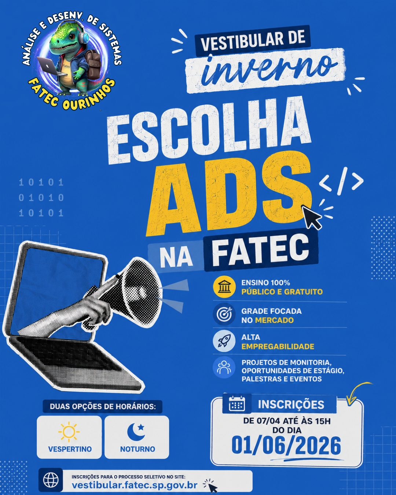
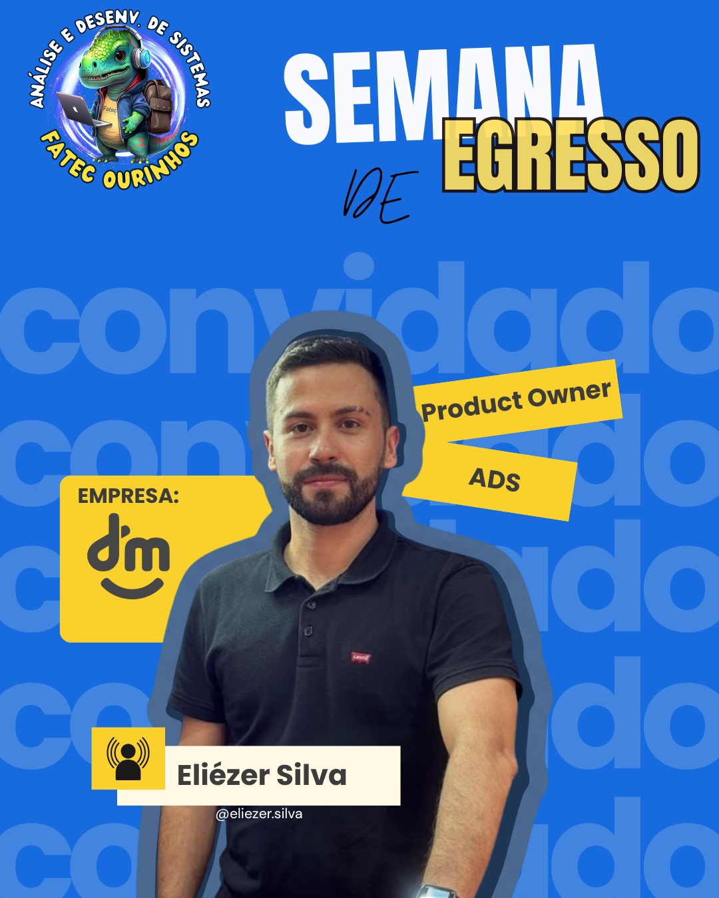
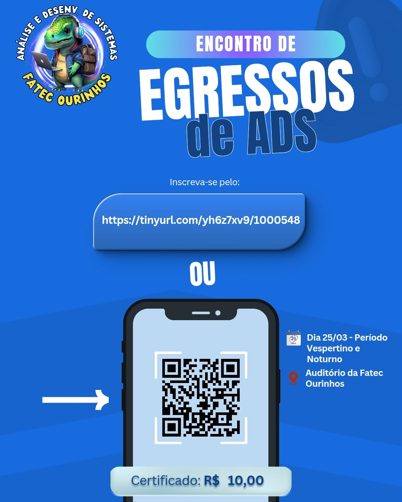
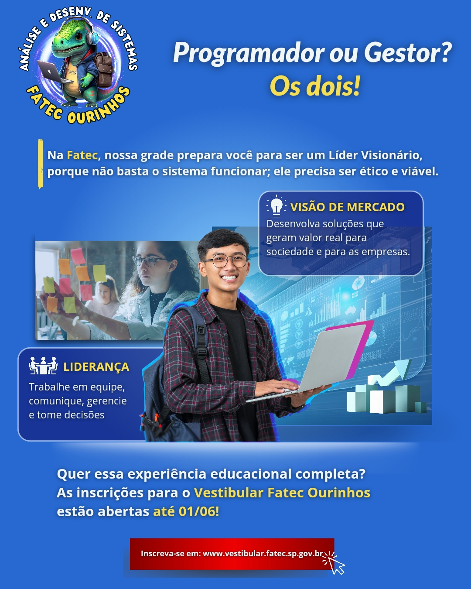
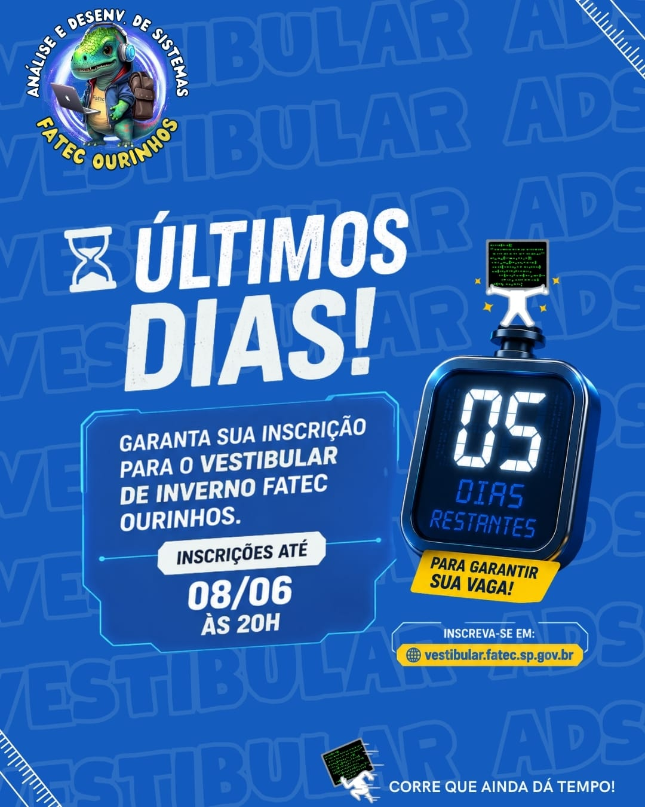
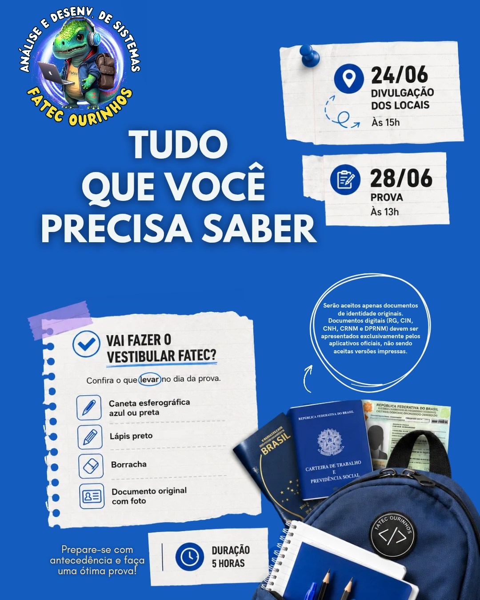

# 🎨 Portfólio de Social Media & Design Gráfico — Comunicação Institucional

  

## 📌 Sobre o Projeto
Este repositório reúne amostras selecionadas do trabalho de **Design Gráfico, Identidade Visual e Gestão de Conteúdo** desenvolvido para a página oficial do Instagram do curso de **Análise e Desenvolvimento de Sistemas (ADS)** da faculdade. 

Como monitora acadêmica responsável pelos canais de comunicação, o principal desafio foi estruturar layouts limpos, profissionais e padronizados, convertendo informações institucionais complexas em artes de alto impacto visual para estudantes e candidatos.

---

## ⏱️ Período de Atuação
* **Início:** Agosto de 2025
* **Fim:** Julho 2026

---

## 🛠️ Competências e Ferramentas
* **Design & Criação Visual:** Canva e Figma.
* **Inteligência Artificial:** Uso de ferramentas de IA generativa para a concepção de elementos visuais inovadores e suporte na estilização de componentes das campanhas.
* **Comunicação Institucional:** Produção de conteúdo livre de jargões redundantes, focado em clareza informativa, revisão minuciosa e tom profissional.
* **Planejamento de Campanhas:** Organização visual dividida por cronogramas operacionais, eventos e períodos seletivos.

---

## 🖼️ Campanhas em Destaque (Amostras do Portfólio)

### 📢 1. Encontro de Egressos de ADS
Material criado para engajar a comunidade acadêmica e promover a divulgação dos palestrantes convidados que já atuam no mercado de tecnologia.

| Card do Palestrante | Banner de Inscrição e QR Code |
| :---: | :---: |
|  |  |

### 🎓 2. Campanha: Vestibular de Inverno 2026
Fluxo completo de layouts desenvolvido para atrair novos alunos e guiar os candidatos cadastrados até o dia da avaliação.

#### 💡 Atração e Conscientização
Artes focadas nos diferenciais da grade do curso e informações gerais sobre prazos de inscrição.

| Chamada de Perfil | Informativo Geral |
| :---: | :---: |
|  |  |

#### 🚨 Engajamento e Instrução Técnico-Comportamental
Peças criadas para a reta final do cronograma, englobando senso de urgência e um guia prático de sobrevivência sobre as diretrizes e documentos necessários para o dia do exame.

| Senso de Urgência (Contagem) | Guia do Candidato (O que levar) |
| :---: | :---: |
|  |  |

---

## 🔗 Link para o Perfil Oficial
Você pode conferir a aplicação e o feed completo com o uso desses templates diretamente no perfil do curso:
👉 [Acessar o Instagram Oficial](https://www.instagram.com/adsfatecourinhos/)

---

Portfólio de monitoria focado em Design Visual, Inteligência Artificial, Identidade de Marca e Comunicação para Comunidades Acadêmicas de Tecnologia.

